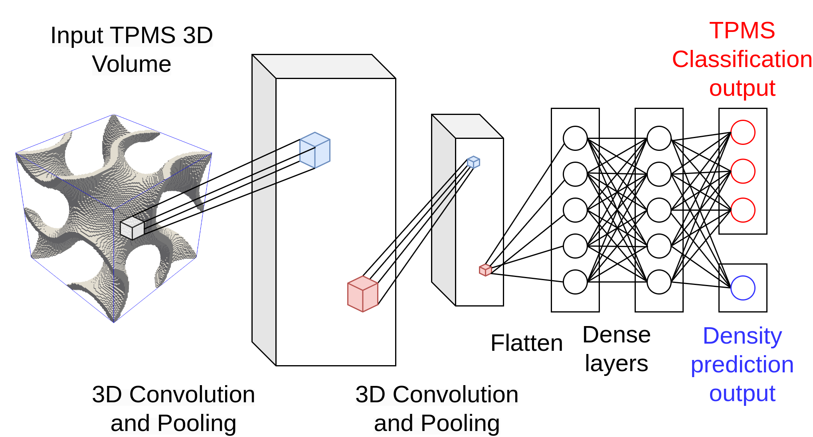
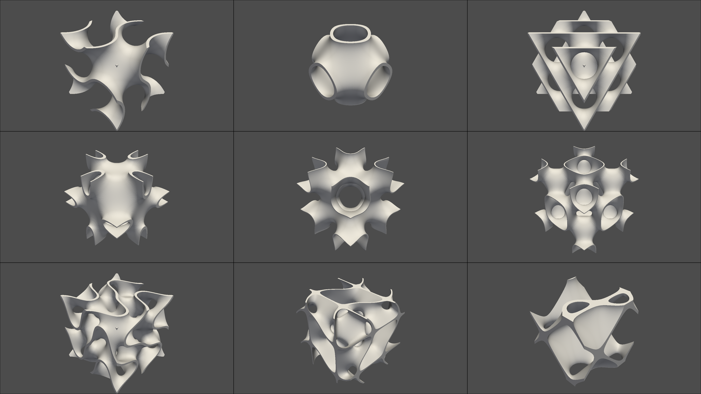

# Classification et estimation de densité de microstructures triplement périodiques avec des réseaux de neurones à convolution 3D
The github repository for the article "Classification et estimation de densité de microstructures
triplement périodiques avec des réseaux de neurones à convolution 3D, M.
Guevara garban [et al.] (sciencesconf.org:csma2024:501154)" presented at CSMA
2024 (16ème Colloque National en Calcul de Structures).





## Installation

Is strongly recommended to install this project using a new conda environnement

```
conda create -n cnn_3d python=3.11
conda activate cnn_3d
```

After cloning the repository, you can install the project and necessary
dependencies using:

```
pip install .
```

## Usage

To generate the learning database you shoud go to `scripts` folder and execute

```
python3 generate_dataset --mesh_resolution 100 --n_samples_per_class 1000 --dataset_folder dataset_mesh/
```

To train the CNN3D (NVIDIA GPU is required), in the same folder named `scripts`
execute
```
python3 train.py --epochs 50 --voxel_resolution 80 --dataset_folder dataset_mesh/
```

Results, learning curves and confusion matrix will be stored in a folder called
`train_cnn`, this results can be visualized using tensorboard.

```
tensorboard --logdir=train_cnn
